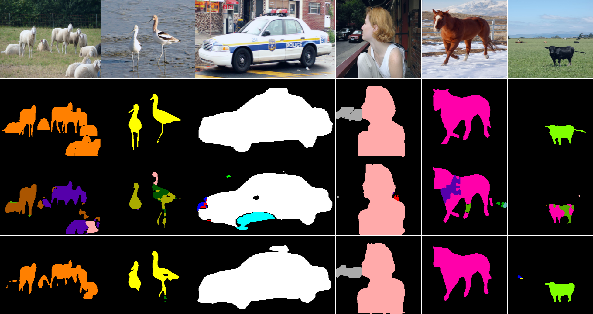
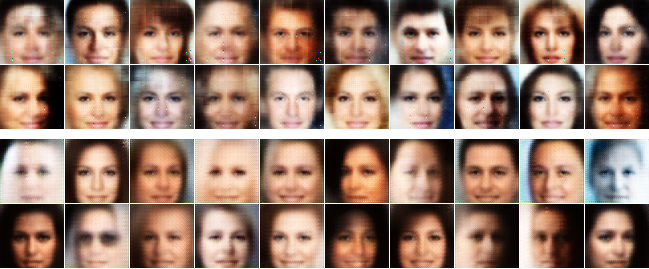

# Pixel Transposed Convolutional Networks

Created by [Hongyang Gao](http://people.tamu.edu/~hongyang.gao/), [Hao Yuan](http://www.eecs.wsu.edu/~hyuan2/), [Zhengyang Wang](http://people.tamu.edu/~zhengyang.wang/) and [Shuiwang Ji](http://people.tamu.edu/~sji/) at Texas A&M University.

## Introduction

Pixel transposed convolutional layer (PixelTCL) is a more effective way to perform up-sampling operations than transposed convolutional layer.

Detailed information about PixelTCL is provided in [arXiv tech report] (https://arxiv.org/abs/1705.06820).

## Citation

If using this code, please cite our paper.

```
@article{gao2017pixel,
  title={Pixel Transposed Convolutional Networks},
  author={Hongyang Gao and Hao Yuan and Zhengyang Wang and Shuiwang Ji},
  journal={arXiv preprint arXiv:1705.06820},
  year={2017}
}
```

## Results

#### Semantic segmentation



Comparison of semantic segmentation results. The first and second rows
are images and ground true labels, respectively. The third and fourth
rows are the results of using regular transposed convolution and our proposed
pixel transposed convolution, respectively.

#### Generate real images (VAE)



Sample face images generated by VAEs when trained on the CelebA dataset.
The first two rows are images generated by a standard VAE with
transposed convolutional layers for up-sampling. The last two rows are images
generated by the same VAE model, but using PixelTCL for up-sampling in the
generator network.

## System requirement

#### Programming language
Python 3.5+

#### Python Packages
tensorflow (CPU) or tensorflow-gpu (GPU), numpy, h5py, progressbar, PIL, scipy

## Prepare data

In this project, we provided a set of sample datasets for training, validation, and testing.
If want to train on other data such as [PASCAL](http://host.robots.ox.ac.uk/pascal/VOC/),
prepare the h5 files as required.
utils/h5_utils.py could be used to generate h5 files.

## Configure the network

All network hyperparameters are configured in main.py.

#### Training

max_step: how many iterations or steps to train

test_step: how many steps to perform a mini test or validation

save_step: how many steps to save the model

summary_step: how many steps to save the summary

#### Data

data_dir: data directory

train_data: h5 file for training

valid_data: h5 file for validation

test_data: h5 file for testing

batch: batch size

channel: input image channel number

height, width: height and width of input image

#### Debug

logdir: where to store log

modeldir: where to store saved models

sampledir: where to store predicted samples, please add a / at the end for convinience

model_name: the name prefix of saved models

reload_step: where to return training

test_step: which step to test or predict

random_seed: random seed for tensorflow

#### Network architecture

network_depth: how deep of the U-Net including the bottom layer

class_num: how many classes. Usually number of classes plus one for background

start_channel_num: the number of channel for the first conv layer


conv_name: use which convolutional layer in decoder. We have conv2d for standard convolutional layer, and ipixel_cl for input pixel convolutional layer proposed in our paper.

deconv_name: use which upsampling layer in decoder. We have deconv for standard transposed convolutional layer, ipixel_dcl for input pixel transposed convolutional layer, and pixel_dcl for pixel transposed convolutional layer proposed in our paper.

## Training and Testing

#### Start training

After configure the network, we can start to train. Run
```
python main.py
```
The training of a U-Net for semantic segmentation will start.

#### Training process visualization

We employ tensorboard to visualize the training process.

```
tensorboard --logdir=logdir/
```

The segmentation results including training and validation accuracies, and the prediction outputs are all available in tensorboard.

#### Testing and prediction

Select a good point to test your model based on validation or other measures.

Fill the test_step in main.py with the checkpoint you want to test, run

```
python main.py --action=test
```

The final output include accuracy and mean_iou.

If you want to make some predictions, run

```
python main.py --action=predict
```

The predicted segmentation results will be in sampledir set in main.py, colored.

## Use PixelDCL in other models

If you want to use pixel transposed convolutional layer in other models, just copy the file

```
utils/pixel_dcn.py
```

and use it in your model:

```

from pixel_dcn import pixel_dcl, ipixel_dcl, ipixel_cl


outputs = pixel_dcl(inputs, out_num, kernel_size, scope)

```

Currently, this version only support up-sampling by factor 2 such as from 2x2 to 4x4. We may provide more flexible version in the future.

